<div align="center">


# 🛡️ CloudGuard 2.0

### **See the risk behind every cloud.**

<p>
  <strong>A dark-mode security operations workspace for cloud exposure, findings, vulnerability intelligence, compliance, and multi-cloud visibility.</strong>
</p>

<p>
  <a href="#-why-cloudguard">Why CloudGuard</a> •
  <a href="#-product-tour">Product Tour</a> •
  <a href="#-security-analytics">Analytics</a> •
  <a href="#-architecture">Architecture</a> •
  <a href="#-quick-start">Quick Start</a>
</p>

<br/>


<br/><br/>


</div>

<br/>

> [!IMPORTANT]
> **CloudGuard 2.0** is presented as a security-operations product concept and UI showcase. Sample metrics and findings shown in the interface are illustrative unless backed by a connected production data source.

---

## ⚡ TL;DR

<table>
<tr>
<td width="55%">

### One workspace. Every signal.

CloudGuard brings fragmented cloud-security signals into one focused command center.

**Connect → Discover → Analyze → Prioritize → Remediate → Verify**

It is designed around the way security teams actually work:

- 🔭 **Exposure visibility**
- 🚨 **Finding prioritization**
- ☁️ **Multi-cloud inventory**
- 🧠 **Vulnerability intelligence**
- 📋 **Compliance posture**
- 🧾 **Operational activity**
- 🔐 **Identity & workspace security**

</td>
<td width="45%">

### 🛰️ Security Surface

```text
AWS ─────┐
Azure ───┤
GCP ─────┤
OCI ─────┼──► CloudGuard
IBM ─────┤       │
DO ──────┤       ├── Exposure
Alibaba ─┘       ├── Findings
                 ├── CVEs
                 ├── Compliance
                 └── Audit
```

</td>
</tr>
</table>

---

# 🎯 Why CloudGuard?

<table>
<tr>
<th>☁️ Problem</th>
<th>🛡️ CloudGuard Response</th>
</tr>
<tr>
<td>Cloud environments are fragmented</td>
<td><strong>Unified multi-cloud workspace</strong></td>
</tr>
<tr>
<td>Security findings become noise</td>
<td><strong>Severity + status + resource context</strong></td>
</tr>
<tr>
<td>Vulnerability feeds live separately</td>
<td><strong>NVD + CISA intelligence surface</strong></td>
</tr>
<tr>
<td>Compliance becomes spreadsheet work</td>
<td><strong>Framework-level posture visualization</strong></td>
</tr>
<tr>
<td>Cloud onboarding is operationally heavy</td>
<td><strong>Dedicated provider connection flow</strong></td>
</tr>
<tr>
<td>Analysts need operational history</td>
<td><strong>Workspace activity / audit surface</strong></td>
</tr>
</table>

---

# 🧬 Product DNA

<div align="center">

| 🔭 VISIBILITY | 🚨 PRIORITY | 🧠 INTELLIGENCE | 📋 GOVERNANCE |
|:---:|:---:|:---:|:---:|
| Cloud Inventory | Findings | Vulnerability Intel | Compliance |
| Exposure Index | Severity | NVD / CISA | CIS / SOC 2 |
| Provider Coverage | Status | CVE Context | PCI / HIPAA |
| Risk Trends | Resources | Exploit Status | NIST CSF |

</div>

---

# 🖥️ Product Tour

## 01 — Authentication

The entry experience keeps the product intentionally minimal: brand, security positioning, provider-neutral authentication, and a sample workspace path.

<div align="center">

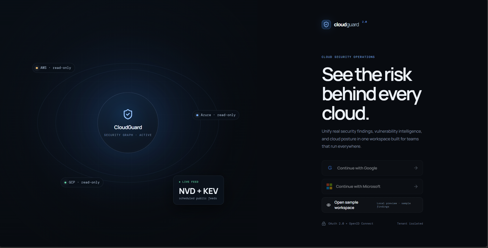

</div>

---

## 02 — Security Overview

The command center surfaces the highest-value signals first:

- Exposure Index
- Open Findings
- Critical Exposure
- Connected Accounts
- Exposure trend
- Severity distribution
- Cloud posture

<div align="center">

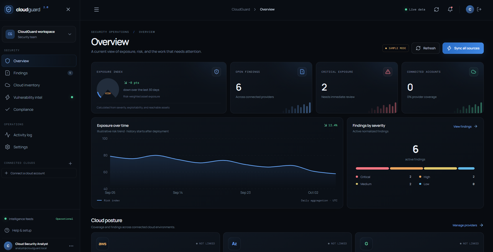

</div>

---

## 03 — Findings

A focused investigation surface for searching, filtering, prioritizing, and tracking cloud-security findings.

<div align="center">

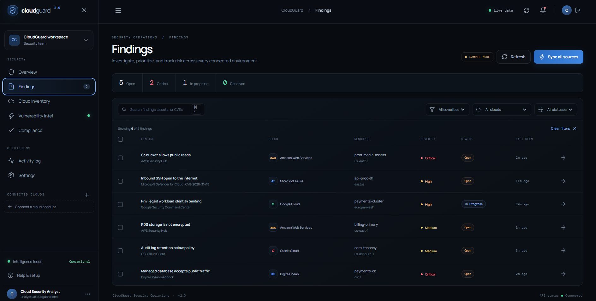

</div>

### Example finding signals

```text
CRITICAL  → S3 bucket allows public reads
HIGH      → Inbound SSH open to the internet
HIGH      → Privileged workload identity binding
MEDIUM    → RDS storage is not encrypted
MEDIUM    → Audit log retention below policy
CRITICAL  → Managed database accepts public traffic
```

---

## 04 — Cloud Inventory

A normalized provider surface for AWS, Azure, Google Cloud and additional webhook/ingestion providers.

<div align="center">

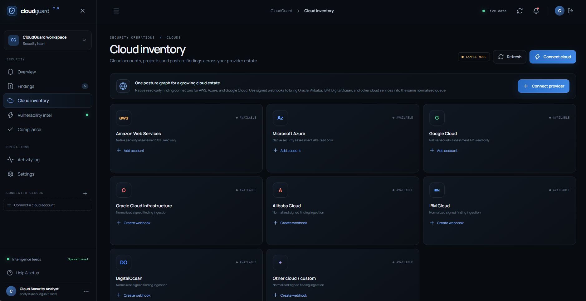

</div>

### Provider surface

`AWS` · `Azure` · `Google Cloud` · `Oracle Cloud` · `Alibaba Cloud` · `IBM Cloud` · `DigitalOcean` · `Custom`

---

## 05 — Provider Connection

Cloud onboarding is presented as a controlled workflow instead of dumping credentials into a dashboard.

<div align="center">

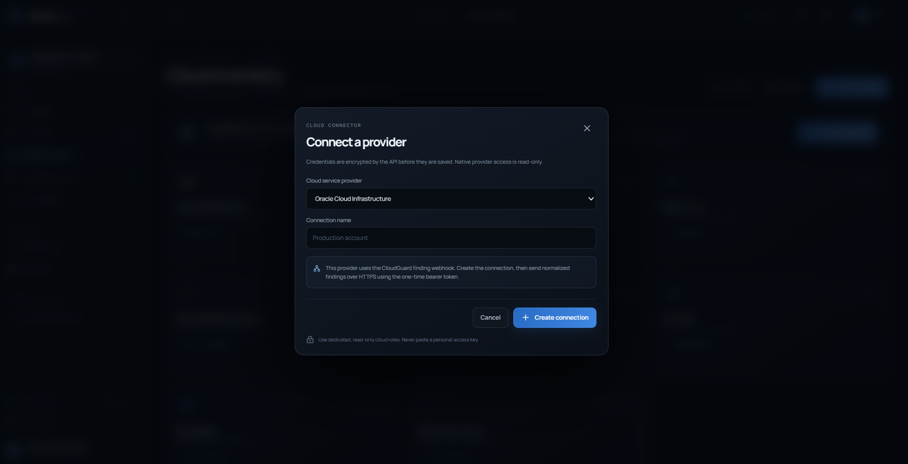

</div>

> 🔐 **Security principle:** use dedicated read-only cloud roles wherever possible. Never commit cloud credentials, API keys, OAuth secrets, or private keys to the frontend or Git history.

---

## 06 — Vulnerability Intelligence

A dedicated intelligence layer for external vulnerability signals, including NVD and CISA KEV concepts.

<div align="center">

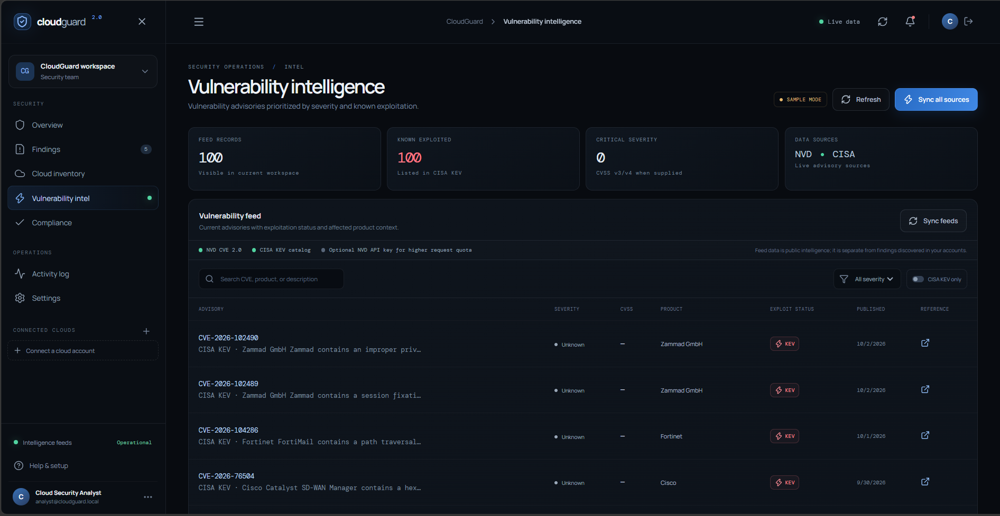

</div>

```text
NVD ─────────────┐
                 ├──► Vulnerability Feed ──► Severity ──► Analyst
CISA KEV ────────┘             │
                               ├── CVE
                               ├── Product
                               ├── Exploit status
                               └── Published date
```

---

## 07 — Compliance Posture

Framework posture is surfaced visually so analysts can immediately see where attention is needed.

<div align="center">

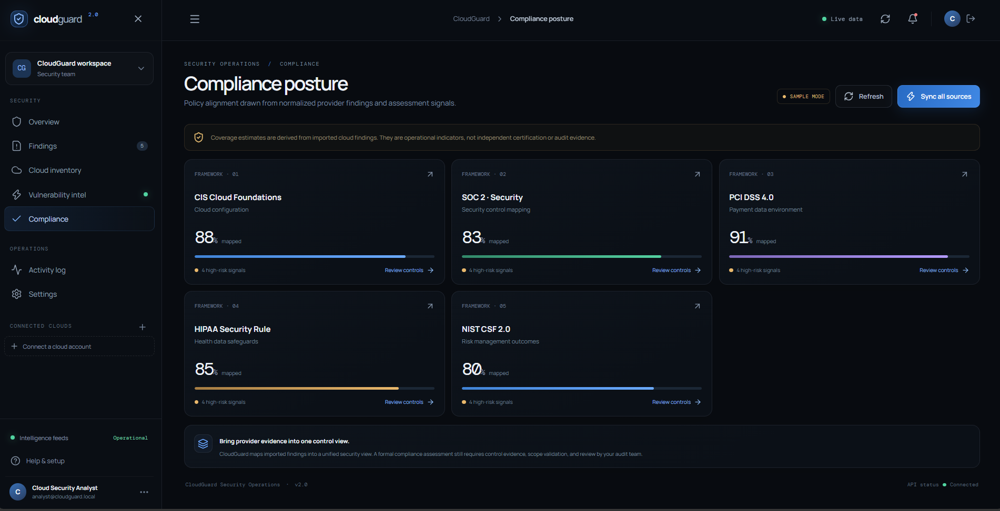

</div>

> The percentages shown above are **sample-mode UI values** from the provided showcase and should not be interpreted as independent certification or audit evidence.

---

## 08 — Activity Log

A dedicated operational timeline for workspace-scoped events such as cloud connections, synchronization, and finding updates.

<div align="center">

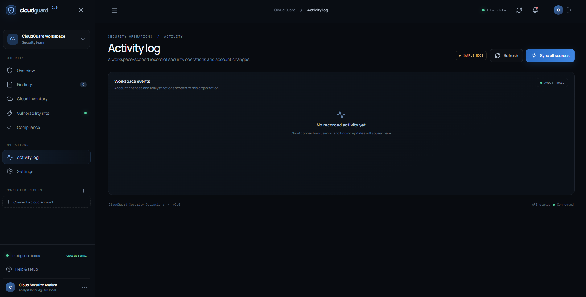

</div>

---

## 09 — Workspace Settings

Identity, credential protection, organization isolation, persistence, and workspace controls in one place.

<div align="center">

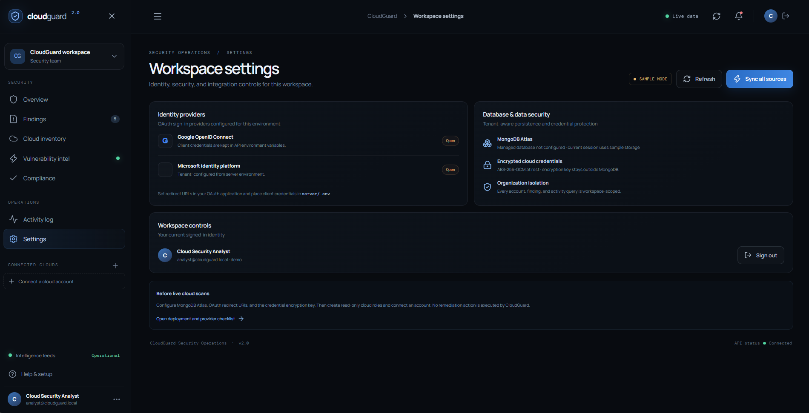

</div>

---

# 📊 Security Analytics

## Finding Severity

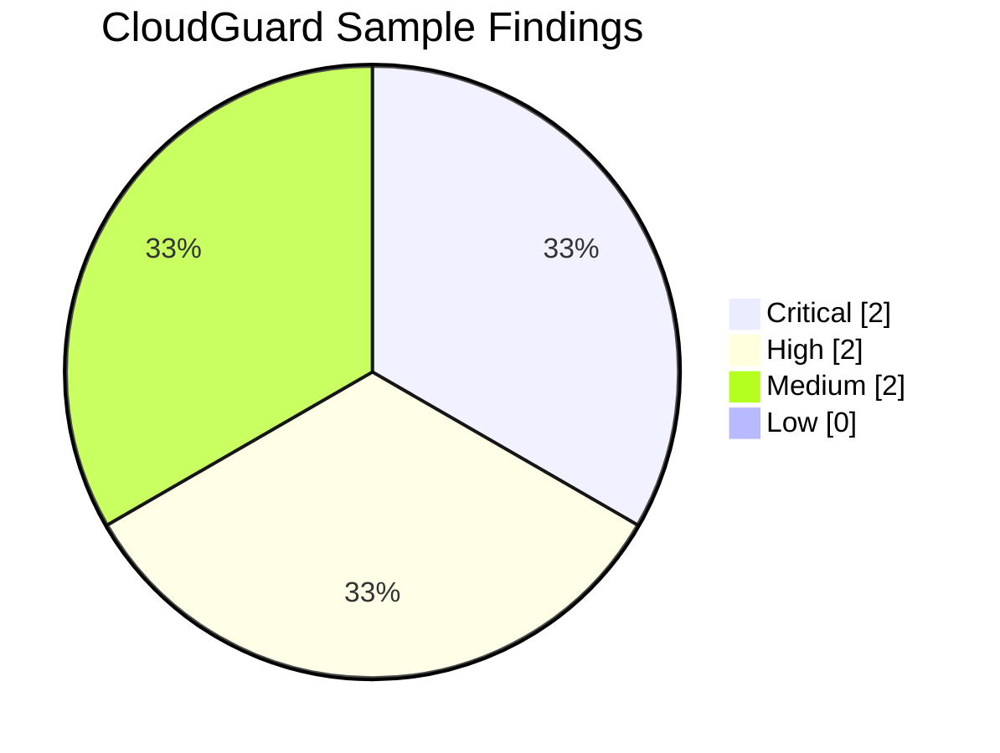

## Compliance Snapshot

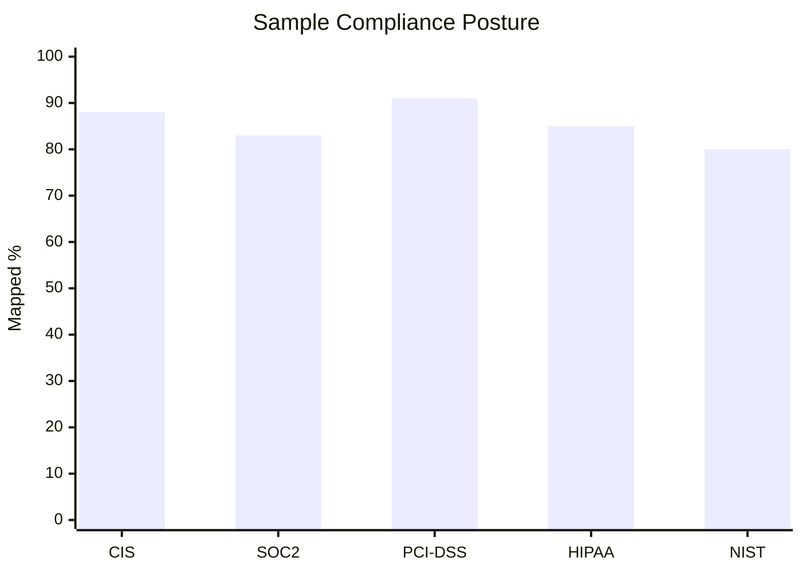

## Exposure Model

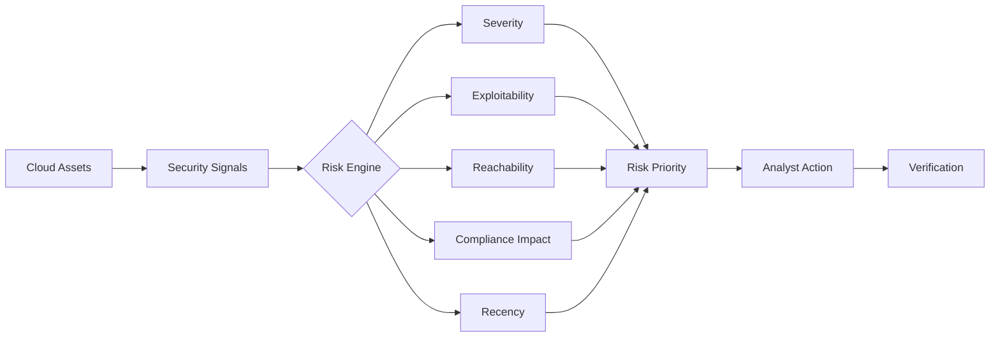

---

# 🧠 Security Workflow

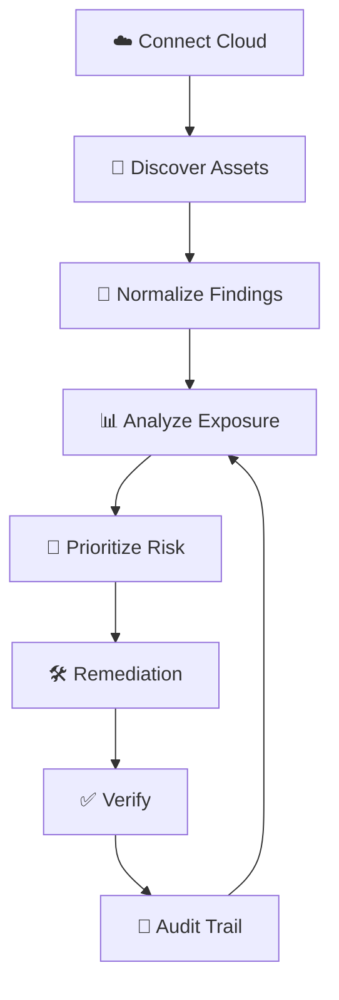

---

# 🏗️ Architecture

The documented repository baseline is intentionally lightweight: a zero-dependency browser implementation with HTML, CSS, JavaScript state, interactions, and Canvas-based analytics.

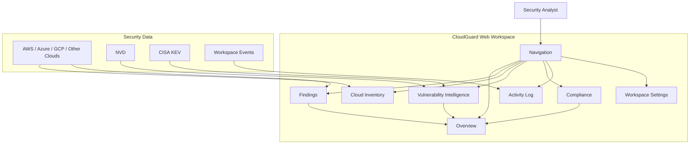

---

# 🧰 Tech Stack

<div align="center">


</div>

| Layer | Technology | Purpose |
|---|---|---|
| UI | HTML5 | Application structure |
| Styling | CSS3 | Dark design system + responsive layout |
| Logic | Vanilla JavaScript | State + interactions |
| Analytics | HTML5 Canvas | Dashboard visualizations |
| Validation | HTML validation tooling | Quality checks |
| Deployment | Docker / Nginx | Production-style serving |

---

# ⚡ Quick Start

## 1. Clone

```bash
git clone <YOUR_REPOSITORY_URL>
cd CloudGuard
```

## 2. Install

```bash
npm install
```

## 3. Run

```bash
npm start
```

Then open the local URL printed by the terminal.

### Zero-tool fallback

```bash
python3 -m http.server 8080
```

Windows:

```powershell
py -m http.server 8080
```

---

# 📁 Project Structure

```text
CloudGuard/
│
├── index.html
├── README.md
├── package.json
│
├── assets/
│   └── screenshots/
│       ├── 01-authentication.png
│       ├── 02-overview.png
│       ├── 03-findings.png
│       ├── 04-cloud-inventory.png
│       ├── 05-provider-connection.png
│       ├── 06-vulnerability-intelligence.png
│       ├── 07-compliance.png
│       ├── 08-activity-log.png
│       └── 09-settings.png
│
├── docs/
│   ├── ARCHITECTURE.md
│   ├── API.md
│   ├── DEPLOYMENT.md
│   └── INTEGRATIONS.md
│
├── Dockerfile
├── docker-compose.yml
├── nginx.conf
├── SECURITY.md
├── CONTRIBUTING.md
└── LICENSE
```

> If a file is not present in your branch, treat the structure above as the intended documentation layout rather than an assertion that every file currently exists.

---

# 🔌 API Integration

A backend can expose normalized findings to the workspace through an authenticated API.

```javascript
async function loadFindings(apiUrl, token) {
  const response = await fetch(`${apiUrl}/v1/findings`, {
    headers: {
      Authorization: `Bearer ${token}`,
      "Content-Type": "application/json"
    }
  });

  if (!response.ok) {
    throw new Error(`CloudGuard API error: ${response.status}`);
  }

  const payload = await response.json();

  return payload.data ?? [];
}
```

### Example finding payload

```json
{
  "id": "CRIT-001",
  "severity": "critical",
  "provider": "aws",
  "service": "s3",
  "resource_name": "prod-media-assets",
  "status": "open",
  "cvss_score": 9.8
}
```

> Never hard-code production credentials in frontend JavaScript. Use a secure backend, environment-managed secrets, least-privilege roles, HTTPS, and proper authentication.

---

# 🧪 Quality Gate

A professional security product should fail loudly when its security assumptions fail.

```text
HTML validation
      │
      ▼
UI smoke tests
      │
      ▼
API contract checks
      │
      ▼
Dependency audit
      │
      ▼
Secret scanning
      │
      ▼
Security review
      │
      ▼
Deploy 🚀
```

Recommended local checks:

```bash
npm audit
```

```bash
git diff --check
```

If your repository includes HTML validation scripts:

```bash
npm run validate
```

---

# 🔐 Security Principles

### Least privilege

Cloud connectors should use the minimum permissions required for discovery and security assessment.

### Secret isolation

Never expose provider secrets, private keys, OAuth client secrets, or encryption keys in browser code.

### Tenant isolation

Workspace data should be scoped by authenticated tenant/workspace identity.

### Encryption

Sensitive credentials should be encrypted at rest and transmitted only over HTTPS.

### Auditability

Security-sensitive operations should produce traceable events.

### No blind remediation

Production security tooling should distinguish between **discovering a risk** and **executing a remediation action**.

---

# 🗺️ Roadmap

```text
[████████████████████] Core UI
[██████████████████░░] Findings workflows
[████████████████░░░░] Cloud connectors
[██████████████░░░░░░] Vulnerability intelligence
[████████████░░░░░░░░] Compliance automation
[██████████░░░░░░░░░░] AI security copilot
[████████░░░░░░░░░░░░] Automated remediation
```

### Next-level ideas

- [ ] AWS read-only connector
- [ ] Azure read-only connector
- [ ] GCP read-only connector
- [ ] Real-time finding ingestion
- [ ] CVE enrichment pipeline
- [ ] CISA KEV correlation
- [ ] Compliance control mapping
- [ ] Security graph / attack-path visualization
- [ ] AI security analyst
- [ ] Risk-based remediation recommendations
- [ ] Slack / Teams alerting
- [ ] GitHub security gates
- [ ] Multi-tenant RBAC

---

# 🧩 Design System

CloudGuard intentionally uses a **dark security-console language**.

```text
BACKGROUND      #05080F
SURFACE         #0A111B
BORDER          #1A2A3D
PRIMARY         #4DA3FF
SUCCESS         #16C784
WARNING         #F5B84B
CRITICAL        #FF667A
TEXT            #F3F7FF
MUTED           #6F89A8
```

### UI principles

- High information density without visual clutter
- Blue as the primary action signal
- Green for healthy/live state
- Amber for warning/sample state
- Red for critical exposure
- Thin borders instead of heavy shadows
- Monospace micro-labels for technical context
- Large typography for security metrics
- Rounded cards with restrained glow

---

# 📸 Screenshot Wall

<div align="center">

<table>
<tr>
<td></td>
<td></td>
</tr>
<tr>
<td></td>
<td></td>
</tr>
<tr>
<td></td>
<td></td>
</tr>
</table>

</div>

---

# 🤝 Contributing

Pull requests are welcome.

```bash
git checkout -b feature/your-feature
git add .
git commit -m "feat: add your feature"
git push origin feature/your-feature
```

Then open a pull request.

### Commit style

```text
feat:     new feature
fix:      bug fix
docs:     documentation
style:    visual/style changes
refactor: internal improvement
security: security hardening
chore:    maintenance
```

---

# ⭐ Support the Project

<div align="center">

### If CloudGuard helped you learn, build, or experiment with cloud security:


<br/><br/>

**Built for people who want to see the risk before the risk becomes an incident.**

</div>

---

<div align="center">


<sub>CloudGuard 2.0 • Multi-Cloud Security Operations • Security-first by design</sub>

</div>
